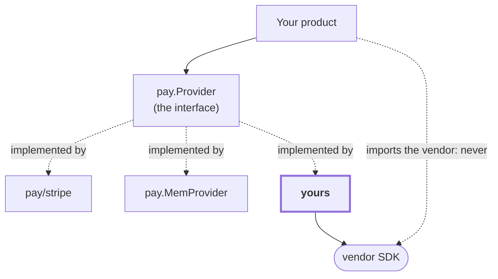

# Writing an adapter

Supporting a processor this library does not ship. The port is one interface and
a conformance suite; if your adapter passes the suite, consumers can swap to it
without reading it.

## What you implement

```go
type Provider interface {
    Name() Name
    Has(c Capability) bool
    CreateCheckout(ctx, CheckoutParams) (Checkout, error)
    EnsureCustomer(ctx, email string, meta map[string]string) (CustomerRef, error)
    ChargeSaved(ctx, SavedChargeParams) (Charge, error)
    ParseWebhook(payload []byte, h http.Header) (Event, error)
}
```

Your adapter is the **only** place the vendor exists.



Only a product's `main` imports an adapter. Everything else depends on the port.

## Declare only what you can do

```go
func (a *Adapter) Has(c pay.Capability) bool {
    switch c {
    case pay.CapCheckout, pay.CapRefund:
        return true
    }
    return false
}
```

Anything you do not declare must return `pay.ErrUnsupported`. Consumers ask
`Has` before offering a feature, so a false claim surfaces at a customer rather
than at compile time. The conformance suite checks both directions.

## Five rules that are not obvious

**1. An unconfigured adapter refuses; it is never nil.** With no keys, return a
refusing adapter whose every method gives `pay.ErrUnconfigured`. A deployment
that does not sell anything still boots, and a caller never dereferences a
missing processor.

**2. An event you do not model is `KindIgnored`, not an error.** The handler
acknowledges it. Returning an error makes the processor redeliver something that
will never become actionable.

**3. Read the whole header set.** `ParseWebhook` takes `http.Header` because
verification schemes differ: one vendor signs in a single header, another
spreads it across five.

**4. Fail closed on anything you cannot key.** A paid event with no reference
gives the ledger nothing to dedupe on, so it would credit again on every
redelivery. Refuse it instead. Same for a currency you cannot convert.

**5. A decline is not a transport error.** Map a refusal to `pay.ErrDeclined`
and never retry it. Map an authentication challenge to `ChargePending` and wait
for the webhook. Conflating them either double-charges or turns every 3-D
Secure prompt into a permanent decline.

## Prove it

```go
func TestMyAdapter(t *testing.T) {
    caps := []pay.Capability{pay.CapCheckout, pay.CapRefund}
    paytest.RunProviderContract(t, func(t *testing.T) pay.Provider {
        return New(Config{ /* pointed at a stub */ })
    }, caps)
}
```

The suite drives every operation your declared capabilities imply and asserts
that everything else returns `ErrUnsupported`.

### Make it coverable

Most of an adapter only runs against the vendor, which is why vendor code tends
to sit at half-covered. The fix is to replace the SDK's transport with one
pointing at an `httptest.Server` returning recorded payloads. The Stripe adapter
here reaches 100% that way, and it covers request shaping — the nested form
encoding that breaks silently on an SDK bump.

Sign webhook fixtures yourself rather than reaching for the network. For an
HMAC scheme that is a few lines, and it lets you test the bad-signature and
stale-timestamp paths that a live account will not produce on demand.

Fuzz `ParseWebhook`. It takes unconstrained bytes from the internet; the two
worst bugs found in this library's own adapter came from a fuzzer, not review.

## Writing a ledger store instead

Same shape. Implement `ledger.Store` and run
`ledgertest.RunStoreContract` against it. It asserts the things that are only
true if every store agrees: concurrent holds admit exactly
`floor(balance/reserve)` of them, concurrent settlements produce one debit,
replayed rollups fold identically, and a failed unit of work moves nothing.

If your store needs to enlist in the caller's transaction, expose that as a
method on the concrete type rather than the interface, the way
`pgledger.Bind(pgx.Tx)` does. A driver handle cannot cross an interface that an
in-memory store also satisfies.
