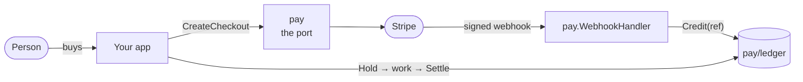

# Getting started

Selling credit and spending it, end to end. About fifteen minutes, no Stripe
account needed until the last section.

## Install

```bash
go get latere.ai/x/pay
```

## The shape of it



Two independent halves. Money comes **in** through the port and lands in the
ledger; work is paid for **out** of the ledger. You can adopt either alone.

## 1. Open a ledger

Start in memory. Nothing here needs a database until you want durability.

```go
book := ledger.NewMemStore()
wallet := ledger.NewHolder("user", "ada@example.com")
```

For Postgres:

```go
pool, _ := pgxpool.New(ctx, os.Getenv("DATABASE_URL"))
if err := pgledger.Migrate(ctx, pool); err != nil { … }
book := pgledger.New(pool)
```

`Migrate` is idempotent and takes an advisory lock, so a rolling deploy running
it from several pods at once is fine. It keeps its own version table,
`ledger_migrations`, beside your product's migrations. If another migrator in
the same database already uses the lock id `pgledger.DefaultMigrationLock`,
call `pgledger.MigrateWithLock` with one that nothing else uses.

## 2. Put money in

Credit takes a reference and is idempotent on it. Money entering from outside
always has one.

```go
err := book.Credit(ctx, ledger.Posting{
    Holder: wallet,
    Amount: 20 * money.Dollar,
    Reason: "topup",
    Ref:    "pi_3Nk…",     // the processor's reference
    Actor:  "stripe:pi_3Nk…",
})
```

Call it twice with the same `Ref` and the balance moves once. That is the entire
defense against a replayed webhook.

## 3. Take money out, safely

The naive version is wrong:

```go
// Don't do this.
if balance >= cost { doWork(); book.Debit(…) }
```

Two requests arriving together both read the old balance and both proceed. Hold
first instead:

```go
const reserve = 5 * money.Dollar

// Admission: commit the money before the work starts.
err := book.Hold(ctx, ledger.Posting{
    Holder: wallet,
    Amount: reserve,
    Group:  jobID,          // the unit of work
    Reason: "session",
})
if errors.Is(err, ledger.ErrInsufficient) {
    return fmt.Errorf("not enough credit")
}

actual := doWork()

// Settlement: release what is left, charge what it really cost.
settled, err := book.Settle(ctx, ledger.Settlement{
    Holder: wallet,
    Group:  jobID,
    Cost:   actual,
    Reason: "session",
})
```

`settled == false` means someone else settled this group first. Not an error.

### Commit the hold with your own row

If the work has a row of its own, the hold and that row must commit together, or
you can end up with a job nobody paid for. `pgledger` enlists in **your**
transaction:

```go
tx, _ := pool.Begin(ctx)
defer tx.Rollback(ctx)

if _, err := tx.Exec(ctx, `INSERT INTO jobs …`); err != nil { return err }
if err := book.Bind(tx).Hold(ctx, posting); err != nil { return err }

return tx.Commit(ctx)   // both, or neither
```

## 4. Show a statement

```go
rows, _ := book.Entries(ctx, wallet, ledger.Page{Limit: 50})
for _, e := range rows {
    fmt.Printf("%s  %12s  %s\n",
        e.CreatedAt.Format("2006-01-02"), e.Amount.String(money.USD), e.Reason)
}
```

Newest first. Page backwards with `Page{Before: oldest.CreatedAt}`.

## 5. Charge a card

Everything above works with no processor. To actually sell credit, add one:

```go
processor := stripe.New(stripe.Config{
    SecretKey:     os.Getenv("STRIPE_SECRET_KEY"),
    WebhookSecret: os.Getenv("STRIPE_WEBHOOK_SECRET"),
})
```

With either value empty, `stripe.New` still returns an adapter, one that
refuses every operation with `pay.ErrUnconfigured`. A local run or a
deployment that does not sell anything boots and declines to sell rather than
failing.

Decide your cut **before** the redirect and carry what it credits on the
session, so an operator editing the spread mid-flight cannot change what an
in-flight purchase is worth:

```go
spread := money.Spread{Bps: 500, FixedMicro: 30 * money.Cent}  // 5% + $0.30
gross := 20 * money.Dollar
credited := spread.Credited(gross)                              // $18.70

out, err := processor.CreateCheckout(ctx, pay.CheckoutParams{
    Email:      "ada@example.com",
    Amount:     gross,
    Currency:   money.USD,
    SuccessURL: "https://example.com/wallet?ok=1",
    CancelURL:  "https://example.com/wallet",
    Meta:       map[string]string{"credited": strconv.FormatInt(int64(credited), 10)},
})
```

Then mount the webhook. See [Webhooks](webhooks.md) for why the status codes
matter and what each event means.

**Never credit from the success URL.** It is attacker-controlled. The webhook
signature is what authenticates a purchase.

## 6. Test it with no processor at all

`pay.MemProvider` is a full `Provider`. It records what it was asked to do and
accepts synthetic deliveries built with `pay.MemEvent`, so your entire money
path is testable offline. This test posts a purchase twice, the way a
processor redelivers, and checks that the wallet moved once:

```go
func TestTopUpCredits(t *testing.T) {
	book := ledger.NewMemStore()
	wallet := ledger.NewHolder("user", "ada@example.com")
	fake := &pay.MemProvider{Secret: "shh"}

	h := pay.WebhookHandler(fake, func(ctx context.Context, e pay.Event) error {
		if e.Kind != pay.KindPaid {
			return nil
		}
		return book.Credit(ctx, ledger.Posting{
			Holder: ledger.Holder(e.Meta["holder"]),
			Amount: e.Gross,
			Reason: "topup",
			Ref:    e.Ref,
		})
	})

	body := pay.MemEvent(pay.KindPaid, "pi_1", 20*money.Dollar,
		map[string]string{"holder": string(wallet)})
	for range 2 { // the second delivery is a replay and credits nothing
		req := httptest.NewRequest(http.MethodPost, "/webhooks/pay", bytes.NewReader(body))
		req.Header.Set(pay.MemHeader, "shh")
		rec := httptest.NewRecorder()
		h.ServeHTTP(rec, req)
		if rec.Code != http.StatusOK {
			t.Fatalf("status %d", rec.Code)
		}
	}

	got, err := book.Balance(context.Background(), wallet)
	if err != nil {
		t.Fatal(err)
	}
	if got != 20*money.Dollar {
		t.Fatalf("balance %s, want $20.00", got.String(money.USD))
	}
}
```

Set `Caps` on the fake to test the paths where your product has to cope with a
processor that cannot do something, `Unconfigured` to test a deployment with no
keys, and `ChargeResult` or `ChargeErr` to drive an off-session charge to each
of its outcomes.

## Next

- [The money model](money-model.md): why a balance is a fold, in depth
- [Webhooks](webhooks.md): the delivery contract
- [Running Stripe](stripe-operations.md): the account settings that change what a customer is charged
