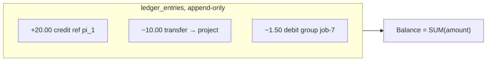
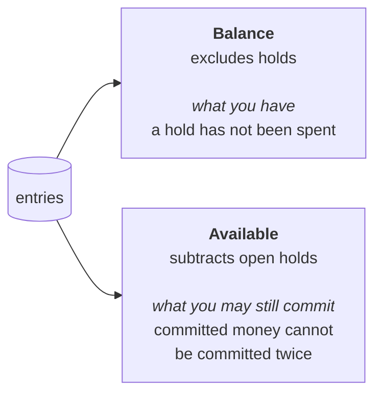
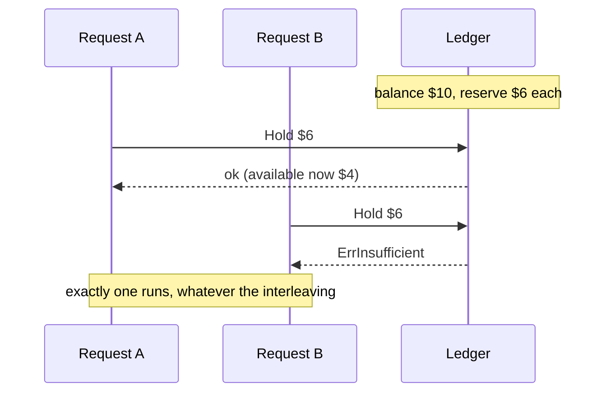
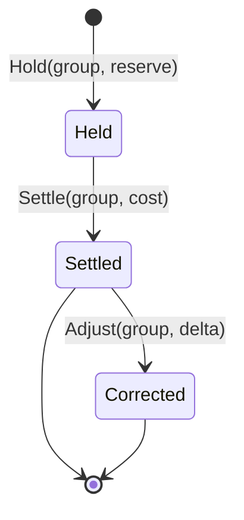

# The money model

Four ideas. Everything else in this library follows from them.

## 1. A balance is never stored

There is one table. Every row is a signed amount against a holder, and nothing
is ever updated or deleted.



A stored balance is a second source of truth, and it drifts the first time a row
is corrected. Folding also means the answer to *why does this holder have this
much* is the rows themselves, each naming its actor and its cause.

A mistake is fixed by another entry, never by an update. That is why there is a
`Reverse` and an `Adjust` and no `Update`.

## 2. Amounts are integers, and the sign belongs to the operation

Money is `money.Micro`: `int64` millionths of a currency unit. Never a float,
because a float cannot represent a tenth of a cent exactly.

It is a defined type, so the compiler refuses to add cents to micros. And every
write takes an **unsigned magnitude**:

```go
book.Debit(ctx, ledger.Posting{Amount: cost, …})  // cost must be positive
```

If `cost` arrives as `-1` from something upstream that means "unpriceable", the
write is refused rather than posting a one-micro *credit*. That is not
hypothetical; it is why the rule exists.

One rounding rule, stated once: **what decides a charge rounds away from zero,
what quotes a number back rounds toward it.** The bias is at most one micro and
always favours the platform. The opposite bias, repeated, is the platform paying.

## 3. A hold is money committed but not spent

Two balances, differing by one predicate.



Admission compares against **Available**. Without that, two requests arriving
together each read a balance that does not yet reflect the other, and both are
let through.



On Postgres the read and the insert happen in one transaction behind an
advisory lock on the holder, which is what makes the check authoritative.

## 4. Settlement is exactly once, and the database enforces it

When the work finishes you settle: release whatever is still held, and debit
what it actually cost.



`Settle` returns `false` when another writer got there first. That is the
guarantee working, not a failure. It is enforced by a partial unique index on
the debit rather than by the caller remembering, and the debit is written
*first* so its conflict is what stops a retry releasing a hold twice.

A zero-cost settlement still writes the debit. It is the marker that closes the
group.

## Idempotency

Every write an outside system can replay takes a `Ref`, and a unique index
refuses a second row for the same one.

- A payment processor's reference on a purchase.
- A refund's **own** reference, distinct from the purchase's, so a clawback
  dedupes independently.
- A window key on a rollup debit, for a caller metering somewhere fast and
  settling here periodically.

```go
ref := ledger.RollupRef(holder, windowStart, seq)
book.Debit(ctx, ledger.Posting{Holder: holder, Amount: delta, Ref: ref, …})
```

Each flush posts the delta accrued since the last one. A retried flush posts the
same reference and does nothing; a lost flush is recovered by the next. This is
what lets a high-rate service keep its hot path off the ledger entirely.

## Holders

A holder is one namespaced string, `"<namespace>:<id>"`.

```go
ledger.NewHolder("user", "ada@example.com")   // user:ada@example.com
ledger.NewHolder("project", projectID)        // project:7f3a…
```

One column, not several nullable ones, so a balance is one predicate and adding
a level later does not reshape the table. **There are no foreign keys**, on
purpose: a ledger must outlive what it records. Deleting a project must not
delete the record of what it cost.

Product dimensions ride along as `Labels`, which the ledger stores and never
interprets. Snapshot them rather than referencing them, so a purged project
still reads correctly in an old statement.
