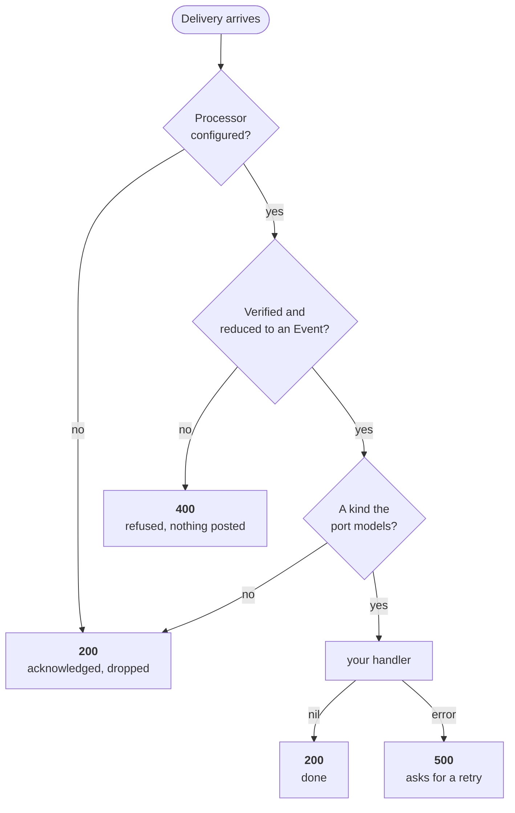
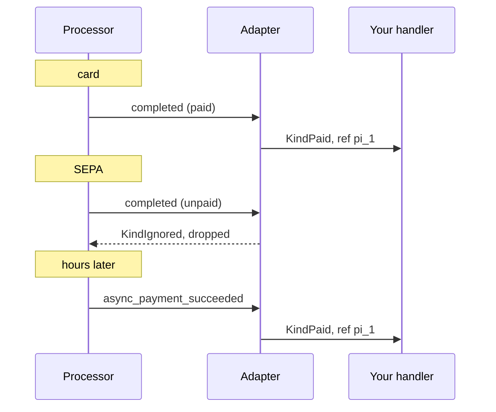
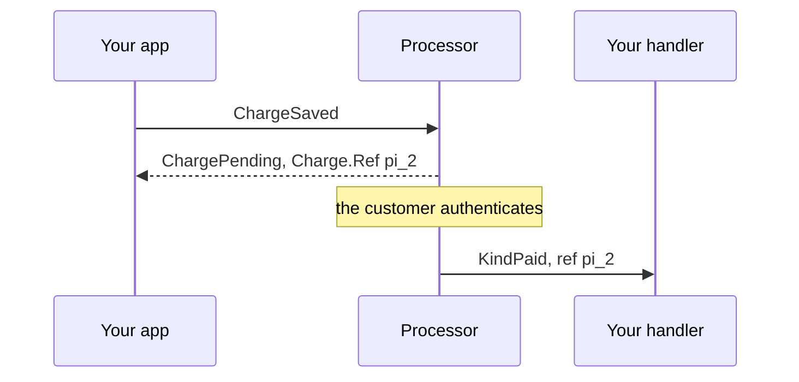

# Webhooks

A webhook endpoint is the only place a stranger can reach your money path. Two
things decide whether it is correct: what you do with an unverified delivery,
and what status code you return.

## Mounting it

```go
mux.Handle("POST /webhooks/stripe", pay.WebhookHandler(processor, onEvent,
    pay.WithLogger(slog.Default())))
```

## The status codes are the contract

Getting these wrong is how a product loses a purchase or credits one twice.



| Situation | Code | Why |
|---|---|---|
| No processor configured, or a nil `Provider` | 200 | Stop a processor redelivering to a deployment that will never accept it |
| The delivery cannot be verified or reduced | 400 | Nothing was posted, and a redelivery of the same bytes is refused the same way |
| An event the port does not model | 200 | It will not become actionable on the fourth redelivery |
| Handler returns `nil` | 200 | Done |
| Handler returns an error | 500 | The **only** code that asks for a retry |

A delivery is refused with 400 when the adapter's `ParseWebhook` returns any
error other than `pay.ErrUnconfigured`: a signature that does not verify, a
body that does not decode, and anything the adapter fails closed on. The
Stripe adapter fails closed on a paid event that carries no reference to
dedupe on, and on an amount it cannot express in USD. Mount the handler with
`pay.WithLogger` to see each refusal; without a logger nothing is logged.

So: return an error from your handler **only** when a retry could succeed. A
database that is briefly down, yes. An event you cannot make sense of, no.

The body is read through a bounded reader, 1 MiB by default and
`pay.WithMaxBody` to change it. A longer body is cut at the limit and then
fails verification. The endpoint is unauthenticated until the signature is
checked, so an unbounded read would be a memory-exhaustion surface open to the
internet.

## What an event means

The adapter reduces a vendor delivery to one flat shape. Your handler never
parses vendor JSON.

| Kind | Meaning | What to do |
|---|---|---|
| `KindPaid` | Money received: a checkout paid, or an off-session charge succeeded | `Credit`, keyed on `Ref` |
| `KindRefunded` | Refunded | `Reverse`, keyed on `ReversalRef` |
| `KindDisputed` | Charged back | `Reverse`, keyed on `ReversalRef` |
| `KindPaymentFailed` | A charge did not go through | Reaches your handler for telemetry or to notify the customer. Never a ledger write; return `nil` |
| `KindIgnored` | Not modeled | Never reaches your handler |

`Ref` is the purchase's reference and is stable across deliveries of the same
purchase. `ReversalRef` is the refund's **own** reference, distinct on purpose,
so a clawback dedupes independently of what it reverses.

## The two-delivery problem

A card pays synchronously, so `completed` is already paid. SEPA Direct Debit,
iDEAL, and Bancontact, the methods European customers reach for, leave
`completed` **unpaid** and confirm later.



Both purchases credit exactly once. The adapter emits `KindPaid` only for a
*paid* session, and the ledger's dedupe on `Ref` is the second line of defense
rather than the only one.

If you subscribe to only one of those two events you have a live bug in one
direction or the other: drop the first and card purchases never credit, drop the
second and bank transfers never do.

## An off-session charge

`ChargeSaved` charges a saved method with nobody present, and it succeeds in
one of two ways. A charge that goes through at once returns `ChargeSucceeded`.
A charge the bank challenges with 3-D Secure returns `ChargePending`: the
customer has to authenticate, and the success arrives later as a `KindPaid`
delivery.



The delivery's `Ref` is the charge's `Charge.Ref`, and its `Meta` is the `Meta`
you passed to `ChargeSaved`. So:

- Credit a `ChargeSucceeded` straight away, under `Charge.Ref`. The processor
  may still deliver a `KindPaid` for it; that one carries the same `Ref`, and
  the ledger posts nothing the second time.
- Never credit a `ChargePending`. Its credit comes from the delivery.

Put the same keys in `SavedChargeParams.Meta` that your handler reads from a
checkout's `Meta`, and one handler credits both. With Stripe, the endpoint has
to be subscribed to `payment_intent.succeeded`; see
[Running Stripe](stripe-operations.md).

## Idempotency is not optional

Processors retry. Networks duplicate. Operators replay from a dashboard. Write
your handler assuming every delivery arrives more than once, and let the
ledger's `Ref` make that safe:

```go
func onEvent(ctx context.Context, e pay.Event) error {
    switch e.Kind {
    case pay.KindPaid:
        return book.Credit(ctx, ledger.Posting{…, Ref: e.Ref})
    case pay.KindRefunded, pay.KindDisputed:
        _, err := book.Reverse(ctx, ledger.Reversal{Of: e.Ref, Ref: e.ReversalRef})
        return err
    }
    return nil
}
```

**Never hand-credit a wallet to fix a webhook problem.** A manual entry has no
processor reference, so when the real delivery lands it credits again.

## Acting on a crossing

`Reverse` reports the balance either side, so your product can decide what a
crossing means without the ledger having an opinion:

```go
eff, err := book.Reverse(ctx, r)
if eff.Applied && eff.Before >= 0 && eff.After < 0 {
    freezeAccount()   // your policy, not the ledger's
}
```

`eff.Applied == false` means the reversal was already recorded.
