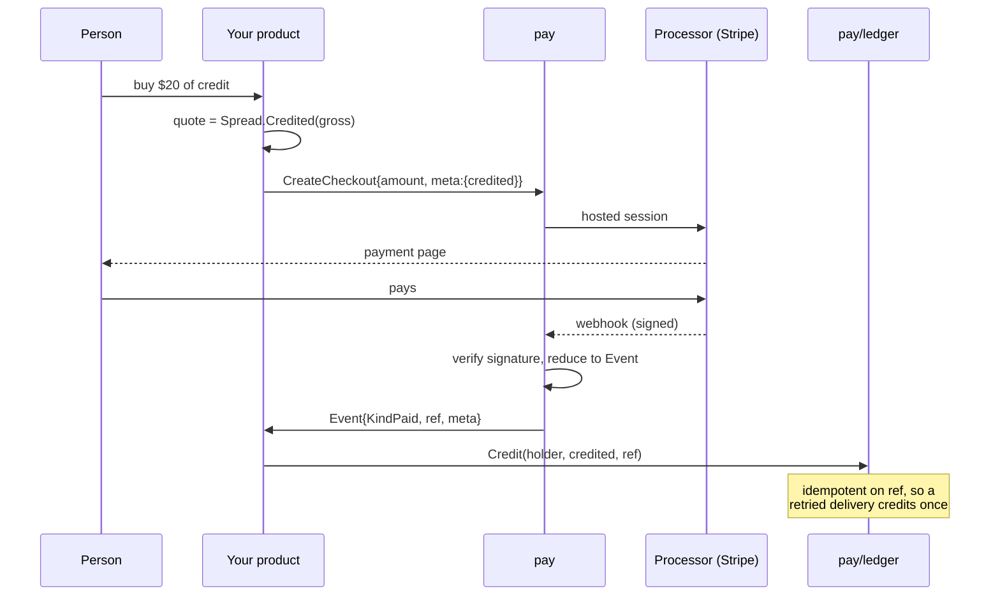

# payment

## Overview

`latere.ai/x/pay`, the repo's root package, says what taking money requires, without
naming a processor: open a payment page, charge a method somebody
already authorised, verify and reduce a webhook. It carries the types,
the errors, an in-memory fake, and the HTTP plumbing that turns a
verified event into a handler call.

It is stdlib only, and the vendor adapters that satisfy it live in
sibling packages (`pay/stripe`) so the port itself never imports a
processor SDK. That separation is not cosmetic. Measured on the two live
integrations:

```
port      100.0% of statements
adapter A  57.7% of statements   (checkout untested)
adapter B 100.0% of statements   (httptest stub over the SDK backend)
```

The port is trivially coverable. A checkout-shaped adapter is not,
because most of it is vendor edge cases that only run against Stripe.
the second implementation's client reaches 100% only because it is tested through an httptest
stub against the stripe-go backend, which is the technique spec 003
adopts for all of it.

## Flow



The credited amount is computed **before** the redirect and carried in
the session metadata, so an operator editing the spread mid-flight
cannot change what an in-flight purchase credits, and the webhook posts
without recomputing. Never from a redirect parameter: the success URL is
attacker-controlled, the webhook signature is not.

## Surface

```go
package pay

// Name identifies the processor an adapter speaks to. A closed
// vocabulary: it is recorded on ledger entries as part of the actor
// string, and a typo there is a reconciliation that never balances.
type Name string

const (
    Stripe Name = "stripe"
    PayPal Name = "paypal"
    Paddle Name = "paddle"
    Memory Name = "memory" // the fake
)

// Capability is one thing a processor can do. A consumer asks before
// offering a feature rather than discovering ErrUnsupported at runtime.
type Capability string

const (
    // CapCheckout is a hosted payment page. Every adapter has it.
    CapCheckout Capability = "checkout"
    // CapSavedMethod is an off-session charge against a stored method:
    // what auto-recharge needs.
    CapSavedMethod Capability = "saved_method"
    // CapRefund means the adapter reports refunds and disputes as events.
    CapRefund Capability = "refund"
    // CapTax means the processor computes and reports tax on the charge.
    CapTax Capability = "tax"
    // CapMerchantOfRecord means the processor is the seller, and the tax
    // and invoice fields on an Event are authoritative rather than ours.
    CapMerchantOfRecord Capability = "merchant_of_record"
)
```

### Errors

```go
var (
    // ErrUnconfigured reports an operation on a deployment with no
    // processor keys. Not a failure: a local run and every test that is
    // not about payment want an app that boots and refuses to sell.
    ErrUnconfigured = errors.New("payments are not configured")
    // ErrBadSignature reports a webhook that did not authenticate. The
    // handler posts nothing.
    ErrBadSignature = errors.New("webhook signature does not verify")
    // ErrUnsupported reports a capability this adapter does not have.
    ErrUnsupported = errors.New("this processor does not support that")
    // ErrDeclined reports a charge the processor refused. Distinct from a
    // transport error because a decline must not be retried.
    ErrDeclined = errors.New("the payment method was declined")
)
```

### The port

```go
type Provider interface {
    Name() Name
    Has(c Capability) bool

    // CreateCheckout opens a hosted payment page.
    CreateCheckout(ctx context.Context, p CheckoutParams) (Checkout, error)

    // EnsureCustomer resolves a durable customer handle for an email,
    // creating one if needed. Idempotent on email. ErrUnsupported when
    // the adapter has no customer concept.
    EnsureCustomer(ctx context.Context, email string, meta map[string]string) (CustomerRef, error)

    // ChargeSaved charges a method the customer already authorised, with
    // no page and nobody present. This is auto-recharge. ErrUnsupported
    // until an adapter implements it.
    ChargeSaved(ctx context.Context, p SavedChargeParams) (Charge, error)

    // ParseWebhook authenticates a delivery and reduces it to an Event.
    // It takes the whole header set, not one signature string: Stripe
    // signs in `Stripe-Signature`, PayPal spreads verification across
    // five headers, and a one-string signature would have to be
    // re-generalised the day a second adapter lands.
    ParseWebhook(payload []byte, h http.Header) (Event, error)
}
```

### Requests

```go
type CheckoutParams struct {
    Email       string
    Customer    CustomerRef // optional; binds the session to a saved customer
    Amount      money.Micro
    Currency    money.Currency
    Description string      // what the line item is called on the page
    SuccessURL  string
    CancelURL   string
    // Meta rides on the session and comes back on the Event. This is how
    // the credited amount reaches the webhook without being recomputed.
    Meta map[string]string
    // IdempotencyKey makes a retried create return the same session
    // rather than a second one. the origin product has none, which is fine when a
    // human clicks once and not fine when a recharge daemon retries.
    IdempotencyKey string
    // Tax says how the charge is taxed. TaxNone keeps the charge equal to
    // what the app quoted; TaxAutomatic lets the processor compute it and
    // report it back on the Event.
    Tax TaxMode
    // SaveMethod asks the processor to store the method for later
    // off-session use. Ignored by adapters without CapSavedMethod.
    SaveMethod bool
}

type TaxMode string

const (
    TaxNone      TaxMode = "none"
    TaxAutomatic TaxMode = "automatic"
)

type Checkout struct {
    URL       string
    SessionID string
}

type CustomerRef struct {
    Provider Name
    ID       string
}

type SavedChargeParams struct {
    Customer       CustomerRef
    Method         string // adapter-specific handle; empty means the default
    Amount         money.Micro
    Currency       money.Currency
    Description    string
    Meta           map[string]string
    IdempotencyKey string // required here, unlike checkout
}

type Charge struct {
    Ref    string // the processor's reference, the ledger's idempotency key
    Status ChargeStatus
}

type ChargeStatus string

const (
    ChargeSucceeded ChargeStatus = "succeeded"
    ChargePending   ChargeStatus = "pending" // an async method; wait for the webhook
    ChargeFailed    ChargeStatus = "failed"
)
```

### The event

```go
// Kind is what a verified delivery means to a ledger.
type Kind string

const (
    // KindIgnored is every event this port does not model. An adapter
    // returns it rather than an error, so an unknown event is acknowledged
    // and not retried forever.
    KindIgnored Kind = ""
    KindPaid     Kind = "paid"     // credit the wallet
    KindRefunded Kind = "refunded" // reverse the credit
    KindDisputed Kind = "disputed" // reverse the credit
    // KindPaymentFailed moves no money. It is modelled anyway because
    // auto-recharge has to learn its attempt failed, and an event reduced
    // to KindIgnored never reaches a handler.
    KindPaymentFailed Kind = "payment_failed"
)

// Event is a verified delivery reduced to what a ledger needs. Flat and
// vendor-free: the adapter does the vendor work (the signature check,
// following a charge to its balance transaction for the USD a EUR charge
// is actually worth) so the handler sees one trustworthy shape.
type Event struct {
    Kind     Kind
    Provider Name
    Email    string
    Customer CustomerRef
    // Ref is the purchase's reference, stable across deliveries of the
    // same purchase. It is the ledger's idempotency key.
    Ref string
    // ReversalRef identifies a refund or dispute, distinct from Ref, so a
    // reversal dedupes on its own reference.
    ReversalRef string
    // Gross is what the charge is worth in micro-USD, at the processor's
    // own rate on this charge.
    Gross money.Micro
    // Tax and Net are filled only by an adapter with CapTax or
    // CapMerchantOfRecord. Zero means "not reported", which is not the
    // same as "no tax", and a consumer that needs the distinction asks
    // Has(CapTax).
    Tax money.Micro
    Net money.Micro
    // InvoiceID and SellerOfRecord are what a merchant-of-record adapter
    // fills so a product can link a person to their own invoice without
    // issuing one.
    InvoiceID      string
    SellerOfRecord string
    // Meta is the session metadata echoed back.
    Meta map[string]string
    // Raw is the verified payload, for an app that needs a field this
    // port does not model. Reading it couples that app to a vendor, so it
    // is a documented escape hatch rather than a normal path.
    Raw []byte
}
```

### HTTP plumbing

```go
// EventFunc handles one verified event. Returning an error asks the
// processor to retry the delivery; returning nil acknowledges it.
type EventFunc func(ctx context.Context, e Event) error

// WebhookHandler is the endpoint a processor posts to. It is the one
// piece of HTTP in this package, because getting the status codes wrong
// is how a product either loses a purchase or double-credits one:
//
//	401/400 on a signature that does not verify (never retried)
//	200 on ErrUnconfigured and on KindIgnored (acknowledged, dropped)
//	200 when the handler returns nil
//	500 when the handler returns an error (the processor retries)
//
// It reads the body with a bounded reader: a webhook endpoint is
// unauthenticated until the signature is checked, so an unbounded
// ReadAll is a memory-exhaustion surface.
func WebhookHandler(p Provider, fn EventFunc, opts ...HandlerOption) http.Handler
```

### The fake

`MemProvider` keeps the origin product's shape and grows with the port: it
records every call for assertions, accepts a JSON-encoded `Event` as a
webhook payload when the signature header matches, and can be
configured to declare or withhold any capability, so a consumer can test
both the auto-recharge path and the `ErrUnsupported` path with no
processor.

## Invariants

1. **Nothing in this package names a vendor.** `Name` holds identifiers,
   not behaviour. The one permitted vendor-shaped field is `Event.Raw`.
2. **No application policy.** The port never emails, never freezes an
   account, never decides what a purchase is worth. the origin product's
   `reversePurchase` reads the balance before, reverses, then notifies on
   the zero crossing; the crossing detection and the mail are the app's,
   and the ledger's `Reverse` returns before/after so the app can decide
   (spec 004).
3. **No ledger dependency.** `pay` imports `money` and stdlib. A
   product wires an `Event` to a ledger write; the port does not know a
   ledger exists.
4. **An unconfigured deployment boots.** Every constructor returns a
   refusing provider rather than nil, so a caller never dereferences a
   missing processor.

## Tests

- The full `Provider` surface against `MemProvider`, including every
  `ErrUnsupported` path.
- `WebhookHandler` status-code table: bad signature, unconfigured,
  ignored kind, handler error, handler success, oversized body,
  unreadable body.
- A fuzz test on `ParseWebhook` through `MemProvider` (it takes
  unconstrained bytes).
- A compile-time `var _ Provider = ...` assertion, and an exported
  `paytest.RunProviderContract(t, factory, caps)` suite that spec 003's
  adapters run against a fake processor, so "is this a valid adapter" is
  a shared test rather than a per-repo opinion.

Coverage floor: 95%, expected 100%.

## Out of scope

Subscriptions and recurring billing. Auto-recharge is threshold-driven,
not calendar-driven, and it is `ChargeSaved` plus a product's own
trigger. If a real subscription product appears, it gets its own port.

Tax computation. `TaxMode` and the tax fields on `Event` carry what a
processor reports. Nothing here computes VAT.

## Dependencies

- [001-money](001-money.md)

## Outcome

**Implemented** 2026-08-22 (`8014a79`), 100% statement coverage on the shipped
package.

Deviations from the sketch, all deliberate:

- The conformance suite is `paytest.RunProviderContract`, not
  `paymenttest`. The spec used both names in different places.
- `hasCapability` is unexported and shared; `MemProvider.Has` treats a nil
  `Caps` as checkout-plus-refund so the common case needs no configuration,
  while an explicit empty set declares nothing. That distinction is what lets a
  consumer test its own `ErrUnsupported` paths.
- `MemEvent` was added so a test builds a delivery without hand-rolling the
  encoding.
- `WithLogger` was added. Deliveries that are dropped rather than retried are
  invisible otherwise, and "the webhook silently did nothing" is the hardest
  payment bug to diagnose.

The coverage floor excludes `paytest`: its remaining statements are assertion
reporting that runs only when an adapter under test is broken.

## Outcome addendum, 2026-08-22

`KindPaymentFailed` was added after the Stripe adapter was built. The spec
listed `payment_intent.payment_failed` as an event to subscribe to and gave it
no kind, so it reduced to `KindIgnored` and `WebhookHandler` dropped it. A
telemetry event a product can never observe is a design bug, not a deferral.

A separate fix in `money`: `FuzzString` found that an unknown currency code was
interpolated raw into the display string, so `Currency("-")` rendered a positive
`Micro(69)` as `"- 0.000069"`, which reads as negative. The fallback symbol is
now reduced to letters. The fuzz target that found it is part of `make fuzz`.
