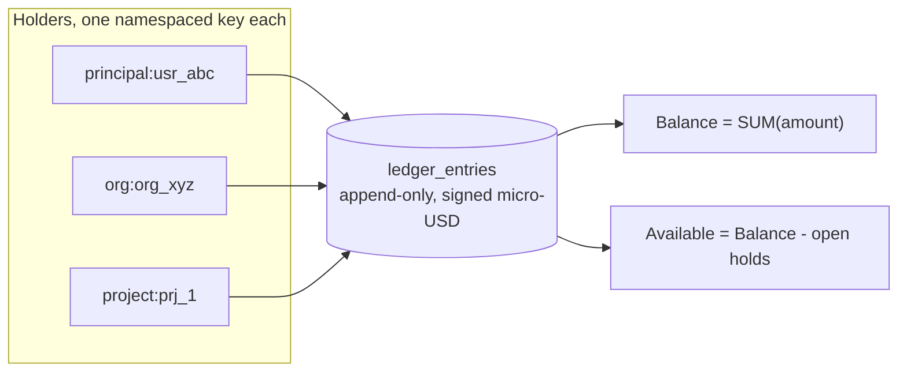
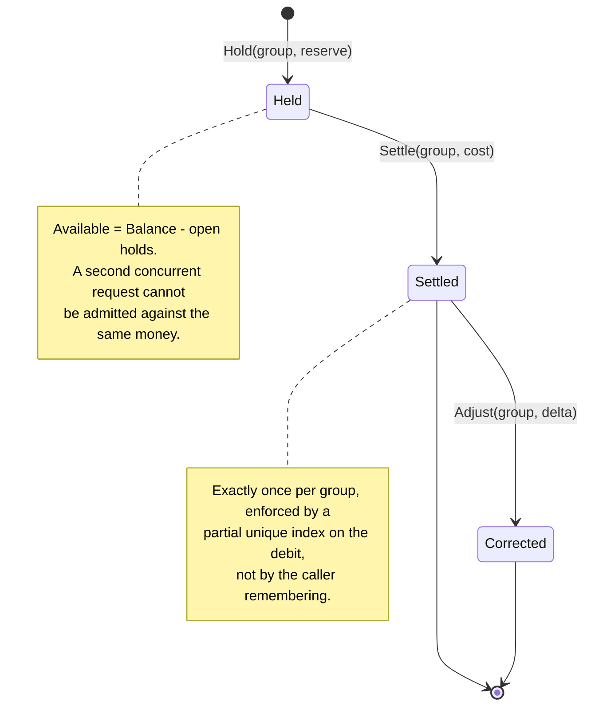

# ledger

## Overview

`latere.ai/x/pay/ledger` is what money the platform holds, whose it is,
and what happened to it. Every balance in every product is a fold over
one append-only table. There is no stored balance anywhere: a
materialised total is a second source of truth and it drifts the first
time a row is corrected. Folding also means the answer to "why does this
holder have this much" is the rows themselves, each naming its actor and
its cause.

Three packages:

| Package | Contents | Dependencies |
|---|---|---|
| `ledger` | domain types, the `Ops` write surface, the `Store` read surface, the in-memory store | `money`, stdlib |
| `ledger/pgledger` | the Postgres store, its migrations, and transaction enlistment | `pgx/v5` |
| `ledger/ledgertest` | the store contract suite both stores must pass | `testing` |

`pgx` enters the repo only through `pgledger`. Module pruning keeps it
out of any binary that imports the port and not the store, so a product
using the ledger over its own storage pays nothing for it. The `money`
and `ledger` packages stay stdlib-only so they remain trivially
coverable and trivially auditable.

## The model



A **holder** is one namespaced string, `"<namespace>:<id>"`, rather than
several nullable columns, so a balance is one predicate and a level
added later does not reshape the table. Products own their namespaces:
the origin product keeps `user:` and `project:`, a gateway uses `principal:` and, when
org billing lands, `org:`.

**`user:<email>` is not a legacy namespace to be tidied away.** the origin product
keys wallets by email for a specific property: an admin can fund somebody
before they have ever signed in, which is the seed-by-email rule its
access model follows throughout. Migrating those holders to
`principal:<uuid>` would destroy it. The namespace survives, unmigrated,
and this paragraph exists so nobody "cleans it up" later.

the second implementation's `billing.Payer` already renders as `principal:<id>` / `org:<id>`,
independently arrived at. Adopt that rendering verbatim rather than
inventing a parallel convention. The package validates the shape and never
resolves an id: **the ledger has no foreign keys**, because a ledger must
outlive the thing it is about. Deleting a project must not delete the
record of what its sessions cost.

### Kind and reason

the origin product's eight kinds mix two different things: ledger mechanics
(does this commit, does it settle) and product vocabulary (`draft` is a
description-drafting model call). Splitting them is what makes the
package shareable.

```go
// Kind is the closed ledger-mechanics vocabulary. It determines the sign
// of an entry and whether it commits. Products do not extend it.
type Kind string

const (
    KindCredit   Kind = "credit"   // + money enters a holder
    KindDebit    Kind = "debit"    // - money leaves a holder
    KindTransfer Kind = "transfer" // paired +/- between two holders
    KindHold     Kind = "hold"     // - committed, not yet spent
    KindRelease  Kind = "release"  // + a hold returned
    KindReverse  Kind = "reverse"  // either sign; undoes a referenced entry
    KindAdjust   Kind = "adjust"   // either sign; a correction after the fact
)

// Reason is the product's label for why. Free-form to the package,
// closed within each product (declare a typed constant set and use it).
// It never affects arithmetic; it is what a statement line reads as.
type Reason string
```

the origin product's `topup` becomes `KindCredit` + `Reason("topup")`, its
`allocate`/`reclaim` become `KindTransfer` with reasons, its `draft`
becomes `KindDebit` + `Reason("draft")`. No behaviour changes; the
mapping is mechanical and covered by the migration in
[pay-04](pay-04-the origin product.md).

### The sign rule

**Kind determines the sign. The API takes an unsigned magnitude.**

```go
func (k Kind) Sign() int // +1, -1, or 0 for the two-signed kinds
```

This is not stylistic. the gateway's `internal/rates` returns
`cost_usd_micro = -1` for a model it cannot price, and today that is
safe only because the one consumer filters it. Passing that number into
a signed-amount API would post a one-micro *credit*. So: `Debit` takes a
positive magnitude and refuses zero or less with `ErrNotPositive`, and
an unpriced call is explicitly not debitable. A product decides whether
to fail closed or park it; the ledger refuses to guess.

### Entry

```go
type Entry struct {
    ID     string
    Holder Holder
    // Amount is signed micro-USD as stored, so a balance is a SUM and
    // never a case analysis over kinds.
    Amount money.Micro
    Kind   Kind
    Reason Reason
    // Ref is an external idempotency key: a processor's payment intent,
    // a refund id, a rollup window key. A unique index refuses a second
    // row for the same ref, which is what makes every write idempotent.
    // Empty on internal moves.
    Ref string
    // Group ties entries that belong together: the two sides of a
    // transfer, and the hold / release / debit of one unit of work. It
    // replaces the origin product's `job_id` with a name that does not assume a job.
    Group string
    // Actor is who caused this, for the statement and the audit trail.
    Actor string
    // Labels are product dimensions the ledger stores and never
    // interprets: the origin product's project name snapshot, the gateway's cost tag. A
    // snapshot, not a reference, which is what lets a purged project
    // still read correctly in an old statement.
    Labels    map[string]string
    CreatedAt time.Time
}
```

## Writes: `Ops`, and enlisting in the caller's transaction

This is the hardest part of the extraction and it deserves the argument.

the origin product deliberately keeps `Hold` and `Settle` **off** its `Store`
interface, because they must run inside the transaction that inserts the
session row. A session may never be terminal and unsettled, and a
`pgx.Tx` handle cannot pass through an interface that both a Postgres
and an in-memory store satisfy. Its answer is that each concrete store
exposes the shape its caller can use, and the contract is asserted by
driving both through the same tests.

A shared package cannot leave it there, but it also must not put `pgx`
in the port. The resolution splits the surface:

```go
// Ops is the portable write surface. Everything that writes money is
// here, and nothing here knows what it is writing to.
type Ops interface {
    Credit(ctx context.Context, p Posting) error
    Debit(ctx context.Context, p Posting) error
    Transfer(ctx context.Context, t Transfer) error
    Hold(ctx context.Context, p Posting) error
    Settle(ctx context.Context, s Settlement) (bool, error)
    Reverse(ctx context.Context, r Reversal) (Effect, error)
    Adjust(ctx context.Context, p Posting) error
}

// Store is Ops plus the reads, plus a way to run several writes atomically
// when the caller has no transaction of its own.
type Store interface {
    Ops
    Balance(ctx context.Context, h Holder) (money.Micro, error)
    Available(ctx context.Context, h Holder) (money.Micro, error)
    BalancesFor(ctx context.Context, hs []Holder) (map[Holder]money.Micro, error)
    Entries(ctx context.Context, h Holder, p Page) ([]Entry, error)
    EntryByRef(ctx context.Context, ref string) (Entry, bool, error)
    NegativeHolders(ctx context.Context, namespace string) ([]HolderBalance, error)
    TotalOutstanding(ctx context.Context, namespaces ...string) (money.Micro, error)
    // BalancesFor and NegativeHolders have ZERO callers in the origin product
    // today: both were built for its spec 026 (an admin people table at
    // scale), which is designed-not-built, and `Admin.List` still does
    // the N+1 balance loop. They are carried into the port because the
    // Postgres implementations exist and are contract-tested, not
    // because anything reads them. Flagged rather than smuggled.

    // Within runs fn as one atomic unit against ledger-owned storage.
    Within(ctx context.Context, fn func(context.Context, Ops) error) error
}
```

and the Postgres store adds the enlistment the port cannot express:

```go
package pgledger

// Bind returns Ops that write inside a transaction the *caller* owns, so
// a hold and the row it guards commit or roll back together. This is the
// method that cannot live on ledger.Store, and it is the reason pgledger
// is a separate package rather than an implementation detail.
func (s *Store) Bind(tx pgx.Tx) ledger.Ops
```

The in-memory store's writes lock the store itself and satisfy `Ops`
directly. Both are driven through
`ledgertest.RunStoreContract(t, factory)`, which is the origin product's
`store_contract_test.go` (646 lines, already green against real
Postgres 16) generalised and exported, so "does this store behave" is one
suite rather than a per-product opinion.

### Postings

```go
type Posting struct {
    Holder Holder
    // Amount is an unsigned magnitude. The Kind supplies the sign.
    Amount money.Micro
    Reason Reason
    Ref    string // idempotency key; required for Credit and for a rollup Debit
    Group  string
    Actor  string
    Labels map[string]string
}

type Transfer struct {
    From, To Holder
    Amount   money.Micro
    Reason   Reason
    Ref, Group, Actor string
    Labels   map[string]string
}

type Settlement struct {
    Holder Holder
    Group  string      // the unit of work whose hold is being settled
    Cost   money.Micro // unsigned; zero is legal and still settles
    Actor  string
    Reason Reason
}

type Reversal struct {
    // Of is the Ref of the entry being undone.
    Of string
    // Ref is the reversal's *own* reference, distinct from Of, so a
    // refund dedupes independently of the purchase it reverses.
    Ref    string
    Actor  string
    Reason Reason
}

// Effect is what a Reverse did, so the app can act on a crossing without
// the ledger knowing what a crossing means. the origin product freezes an account
// and emails on Before >= 0 && After < 0; that policy stays in the origin product.
type Effect struct {
    Applied bool
    Amount  money.Micro
    Before  money.Micro
    After   money.Micro
}
```

## Hold and settle



Two invariants carried over verbatim, because each was earned:

- **`Hold` reads and writes the same table in one transaction, behind an
  advisory lock on the holder.** A check on one connection and an insert
  on another lets two concurrent requests each read the other's
  uncommitted hold as absent and both be admitted.
- **`Settle` writes the debit first and lets its conflict be the
  exactly-once mechanism.** Releasing first would let a retry release
  twice before discovering the debit. `Settle` returns `false` when
  another writer got there first, which is the guarantee working, not a
  failure.

## The rollup debit, which is what lets a gateway use this at all

the origin product's traffic is long sessions: one hold, one settle, tens of rows
a day. the gateway's is a gateway: thousands of short calls a second, already
metered into Redis day and month counters with S3 archival, precisely
because a Postgres row per request did not scale (a gateway its own metering specs).

So the port must not assume one row per billable event. It does not need
a new method; it needs a documented shape and one guarantee.

**Shape.** A rollup debit is an ordinary `Debit` whose `Ref` is a window
key:

```
Ref = "<holder>:<window-start-RFC3339>:<seq>"
```

Each flush posts the delta accrued since the last flush, under a
monotonically increasing `seq`. A retried flush posts the same ref and
is a no-op. A lost flush is recovered by the next one, because the
counter it reads from is cumulative within the window.

**Guarantee.** The unique index on `Ref` makes this exact, and
`Debit` must therefore be idempotent on a *non-empty* ref for every
store. Where the origin product requires a ref only for paid entries, this
package requires it for any write a product intends to retry, and
documents that a ref-less write is at-least-once by construction.

The Redis-side reservation counter that makes this safe on the hot path
is the gateway's design, not this package's (a consumer's own concern).
What this package
guarantees is that a two-tier consumer is possible: the ledger is the
authority, the counter is a cache, and reconciliation is a fold.

## Schema

```sql
CREATE TABLE ledger_entries (
    id         TEXT PRIMARY KEY,
    holder     TEXT NOT NULL,          -- "<namespace>:<id>"
    amount     BIGINT NOT NULL,        -- signed micro-USD
    kind       TEXT NOT NULL,
    reason     TEXT NOT NULL DEFAULT '',
    ref        TEXT,
    grp        TEXT,
    actor      TEXT NOT NULL,
    labels     JSONB,
    created_at TIMESTAMPTZ NOT NULL
);

-- Every balance is a fold over one holder. This is the index that makes
-- the whole model affordable.
CREATE INDEX ledger_entries_holder ON ledger_entries (holder);

-- Idempotency. Partial, so internal moves with no external reference are
-- unconstrained.
CREATE UNIQUE INDEX ledger_entries_ref ON ledger_entries (ref) WHERE ref IS NOT NULL;

-- Exactly-once settlement per unit of work.
CREATE UNIQUE INDEX ledger_entries_one_debit ON ledger_entries (grp)
    WHERE kind = 'debit' AND grp IS NOT NULL;

-- Settlement and the watchdog find a group's open hold.
CREATE INDEX ledger_entries_group ON ledger_entries (grp) WHERE grp IS NOT NULL;
```

Migrations are applied under a per-namespace advisory lock, because a
rolling deploy runs two pods that both find a version missing and both
run its DDL. The lock id is configurable at construction: the origin product
already allocates 1 through 6 to its own migrators, and a shared package
that hardcodes one would collide.

### Balance arithmetic

$$
\text{Balance}(h) = \sum_{e \,\in\, E_h} a_e
\qquad
\text{Available}(h) = \text{Balance}(h) - \!\!\sum_{\substack{e \in E_h \\ k_e \in \{\text{hold},\text{release}\}}}\!\! -a_e
$$

A hold is negative and a release is positive, so their sum negated is the
open commitment. `Balance` excludes holds because a hold has not been
spent; `Available` subtracts them because committed money cannot be
committed twice. That distinction is the entire concurrency story.

## What stays in the products

Deliberately **not** extracted, because each is authority or policy
rather than ledger mechanics:

- **Authorization.** the origin product's `Store` takes an `access.Principal` on
  every write and checks a tier or a role. The shared ledger has no
  caller and no opinion: a route mounted without a guard is the product's
  bug. the origin product keeps a thin authorizing wrapper over `Ops` that
  preserves its current method signatures exactly.
- **`Allocate` / `Reclaim`**, which are `Transfer` plus a membership check.
- **`Fund` / `Unwind`**, whose whole rationale is the circularity of
  deriving membership inside the request that creates a project.
- **Pricing.** `price.go`, `coverage.go`, `Card`, `Rates`, `Preference`.
  a gateway has its own rate card and the two must not be merged.
- **Notification.** The freeze email on a zero crossing. `Reverse`
  returns `Effect`; the product decides what a crossing means.

## Tests

- `ledgertest.RunStoreContract` run against the memory store in the unit
  suite and against real Postgres when `DATABASE_URL` is set, mirroring
  the origin product's existing arrangement.
- Concurrency: N goroutines holding against one holder admit exactly
  `floor(balance / reserve)` of them and the rest get `ErrInsufficient`
  (the origin product's `concurrent_test.go`, generalised).
- Exactly-once: concurrent settles of one group produce one debit.
- Idempotency: the same ref twice moves the balance once; a reversal
  dedupes on its own ref independently of the purchase's.
- Rollup: a sequence of window-keyed debits with replays interleaved
  folds to the same balance as the same sequence without replays.
- Sign safety: `Debit` with a zero or negative magnitude is
  `ErrNotPositive`, asserted with `-1` specifically, named for the gateway's
  sentinel.
- Fuzz on `ParseHolder` and on the label JSON round-trip.

Coverage floor 95% for `ledger` and `ledger/pgledger` combined, with the
Postgres store's uncovered paths limited to ones that need a database.

## Out of scope

Double-entry bookkeeping with a chart of accounts. This is a single-sided
signed ledger with paired transfers, which is what both products need and
what the existing implementation has proven. Moving to full double entry
is a different spec and should not be smuggled into an extraction.

Multi-currency holders. One ledger currency, USD, forever until a spec
says otherwise.

## Dependencies

- [001-money](001-money.md)

## Outcome

**Implemented** 2026-08-22 (`ff05656`, `42b04ac`). 96.0% across shipped
packages, contract green against real Postgres 16.

The `Ops` / `Store` split works as designed: `pgledger.Store.Bind(pgx.Tx)`
returns operations that run inside the caller's transaction, and the contract
asserts that a hold taken there dies with a rollback and survives a commit.

**The contract earned its keep immediately.** It found four bugs in the
Postgres store before any consumer existed:

1. `ON CONFLICT (grp) WHERE kind = 'debit'` did not match the partial unique
   index, whose predicate also carries `AND grp IS NOT NULL`. Postgres cannot
   infer an index from a partial predicate that differs, so settlement was
   never exactly-once and concurrent settles charged a group repeatedly.
2. `Transfer` inferred idempotency from a `created_at` window *after* writing
   the debit, so a replay posted the receiving side twice.
3. `TotalOutstanding` bound a nil slice as SQL NULL, making the whole predicate
   NULL, so "all namespaces" summed to zero.
4. Validation and id minting were duplicated per store, which is how two stores
   drift into refusing different things.

Additions beyond the spec:

- `ledger.CheckPosting`, `CheckTransfer` and `NewID` are exported, so an
  implementation of `Ops` in another package shares one definition.
- `SetRandReadForTest` makes the id-mint failure reachable, which is how the
  "a write that cannot mint an id must not land" guarantee is tested.
- `RollupRef` normalises its window to UTC, so a caller in another time zone
  cannot double-post a window.
- `MemStore.Within` rolls back by snapshotting, so both stores satisfy the
  contract's "a failed unit moves nothing".

**Carried from the spec but worth restating:** `BalancesFor` and
`NegativeHolders` still have no caller anywhere. They are contract-tested and
speculative.
